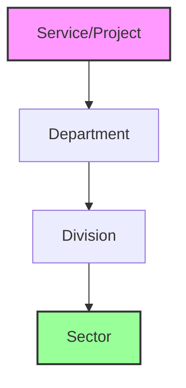

Based on your requirements and the OBINexus constitutional framework, I'll create a comprehensive schema documentation. Let me establish the directory structure and create the necessary documentation.

```bash
# Create schema directory structure
mkdir -p ~/obinexus/legal/schema
cd ~/obinexus/legal/schema
```

Now, let me create the comprehensive schema documentation:

```markdown
# OBINexus Organizational Schema Documentation
## Version 1.0 - Constitutional Implementation Framework

### Executive Summary

The OBINexus Schema represents a **non-monolithic organizational architecture** that enables systematic growth from services to sectors while maintaining constitutional governance and operational independence. This document establishes the permanent technical specification for OBINexus domain architecture, email infrastructure, and organizational evolution pathways.

---

## 1. Core Schema Definition

### 1.1 Canonical Schema Format

```
{<service>}.<department>.obinexus.<division>.org
```

Where:
- **`<service>`**: Project-level implementations (e.g., iaas, polycall, obicall)
- **`<department>`**: Access control layer (public, private, protected)
- **`<division>`**: Constitutional business units (computing, legal, publishing, uche, axis, aeroscale)

### 1.2 Schema Components Breakdown

#### Services (*) - Project Layer
```yaml
services:
  iaas:     "Infrastructure as a Service - Polyglot infrastructure syscall"
  polycall: "Polyglot function call system for cross-language integration"
  obicall:  "Ontological Bayesian inference for AI function call systems"
  syscall:  "System call function driver for kernel rings"
```

#### Departments (-) - Access Control Layer
```yaml
departments:
  public:    "Open access with OCS (Open Credit Score) metrics"
  private:   "Internal division operations only"
  protected: "Pay-as-you-go or subscription-based access"
```

#### Divisions (--) - Business Units
```yaml
divisions:
  computing:  "Technical innovation hub"
  legal:      "Constitutional legal infrastructure"
  publishing: "Creative expression & publication"
  uche:       "Cultural computing & knowledge fashion"
  axis:       "Research & development coordination"
  aeroscale:  "Aerospace innovation division"
```

---

## 2. Email Infrastructure Implementation

### 2.1 Email Address Format

```
{service}.{department}.{division}@obinexus.org
```

### 2.2 Example Email Addresses

```bash
# Computing Division Services
syscall.public.computing@obinexus.org
syscall.protected.computing@obinexus.org
syscall.private.computing@obinexus.org

polycall.public.computing@obinexus.org
polycall.protected.computing@obinexus.org
polycall.private.computing@obinexus.org

obicall.public.computing@obinexus.org
obicall.protected.computing@obinexus.org
obicall.private.computing@obinexus.org

# Cross-Division Services (Axis R&D)
research.public.axis@obinexus.org
development.protected.axis@obinexus.org
integration.private.axis@obinexus.org
```

### 2.3 URL Mapping Convention

Each email maps to a corresponding web service:

```
Email: {service}.{department}.{division}@obinexus.org
URL:   https://www.{service}.{department}.obinexus.org
```

Examples:
```
syscall.protected.computing@obinexus.org → https://www.syscall.protected.obinexus.org
obicall.public.axis@obinexus.org → https://www.obicall.public.obinexus.org
```

---

## 3. Organizational Evolution Model

### 3.1 Growth Pathway



### 3.2 Evolution Criteria

#### Department → Division Transition
- Demonstrated operational independence
- Constitutional compliance verification
- Sustainable resource model
- Example: `axis.research` → `axis division`

#### Division → Sector Formation
- Multiple divisions sharing policies/operations
- Market presence and sustainability
- Cross-division collaboration protocols
- Example: `computing + uche` → `digital arts sector`

### 3.3 Sector Examples

```yaml
sectors:
  digital_arts:
    composition: [computing, uche]
    shared_policies: [creative_tech, digital_fashion]
    
  health_social_care:
    composition: [health, social_care, housing]
    shared_operations: [care_protocols, community_support]
```

---

## 4. Access Control Implementation

### 4.1 Department-Level Access Matrix

| Department | Authentication | Billing Model | Policy Framework |
|------------|---------------|---------------|------------------|
| Public | OCS Credit Score | Free/Contribution | HACC, Use It Respect It |
| Protected | Payment Gateway | Pay-as-you-go | #SorryNotSorry |
| Private | RBAC | Internal Only | Constitutional Compliance |

### 4.2 OCS (Open Credit Score) Integration

```yaml
ocs_policies:
  promotion_criteria:
    - contribution_quality
    - community_engagement
    - constitutional_alignment
  
  demotion_triggers:
    - policy_violations
    - ghosting_behavior
    - resource_abuse
```

---

## 5. Google Workspace Configuration

### 5.1 Organizational Unit Structure

```
/OBINexus
├── /Divisions
│   ├── /Computing
│   ├── /Legal
│   ├── /Publishing
│   ├── /UCHE
│   ├── /Axis
│   └── /Aeroscale
└── /Services
    ├── /IAAS
    ├── /Polycall
    └── /Obicall
```

### 5.2 Google Groups Configuration

```yaml
groups:
  - obinexus-computing@googlegroups.com:
      description: "Computing division collaboration"
      access: "division_members_only"
      
  - obinexus-legal@googlegroups.com:
      description: "Legal division operations"
      access: "authorized_legal_staff"
      
  - obinexus-axis-rnd@googlegroups.com:
      description: "R&D coordination"
      access: "cross_division_authorized"
```

### 5.3 Security Policies

```yaml
security_enforcement:
  - strict_division_boundaries: true
  - cross_division_intrusion: prohibited
  - mission_specific_access: enforced
  - audit_trail: mandatory
  - data_isolation: per_division
```

---

## 6. Implementation Commands

### 6.1 Google Workspace Admin Commands

```bash
# Create Organizational Units
gam create org "/OBINexus/Divisions/Computing"
gam create org "/OBINexus/Divisions/Legal"
gam create org "/OBINexus/Divisions/UCHE"

# Create Service Accounts
gam create user syscall.public.computing@obinexus.org orgunit "/OBINexus/Divisions/Computing"
gam create user syscall.protected.computing@obinexus.org orgunit "/OBINexus/Divisions/Computing"

# Set up Email Routing
gam create routingsetting "Public Services" \
  --match "*.public.*@obinexus.org" \
  --route "public-gateway@obinexus.org"

gam create routingsetting "Protected Services" \
  --match "*.protected.*@obinexus.org" \
  --route "payment-gateway@obinexus.org"
```

### 6.2 DNS Configuration

```bash
# MX Records
obinexus.org.  IN  MX  1  aspmx.l.google.com.
obinexus.org.  IN  MX  5  alt1.aspmx.l.google.com.
obinexus.org.  IN  MX  5  alt2.aspmx.l.google.com.

# SPF Record
obinexus.org.  IN  TXT  "v=spf1 include:_spf.google.com ~all"

# DKIM (obtain from Google Admin)
google._domainkey.obinexus.org.  IN  TXT  "v=DKIM1; k=rsa; p=..."
```

---

## 7. Non-Monolithic Governance Principles

### 7.1 Division Autonomy

Each division maintains:
- Independent operational control
- Separate budget and resource allocation
- Constitutional compliance responsibility
- Service-level sovereignty

### 7.2 Inter-Division Protocol

```yaml
inter_division_rules:
  collaboration: "Permitted through formal agreements"
  resource_sharing: "Requires bilateral approval"
  data_access: "Strictly controlled via API"
  mission_intrusion: "Constitutionally prohibited"
```

### 7.3 Constitutional Enforcement

All operations validated through:
- Automated Constitutional Compliance Engine
- Machine-verifiable governance protocols
- Zero-trust verification at all boundaries
- Blockchain-backed audit trails

---

## 8. Future-Proof Design

### 8.1 Scalability Provisions

The schema supports:
- Unlimited service additions per division
- Dynamic department creation
- Sector formation through division collaboration
- International expansion (.co.uk, .eu variants)

### 8.2 Migration Pathways

```yaml
migration_support:
  legacy_addresses: "Forwarding rules for 2 years"
  subdomain_support: "Automatic routing preservation"
  api_versioning: "Backward compatibility guaranteed"
  data_portability: "Full export compliance"
```

---

## Appendix A: Quick Reference

### Email Pattern
```
{service}.{public|private|protected}.{division}@obinexus.org
```

### URL Pattern
```
https://www.{service}.{public|private|protected}.obinexus.org
```

### Division List
- computing
- legal
- publishing
- uche
- axis
- aeroscale

### Department Types
- public (OCS authenticated)
- private (internal only)
- protected (paid access)

---

## Legal Notice

This schema specification operates under the OBINexus Constitutional Legal Framework. All implementations must maintain constitutional compliance with automated enforcement mechanisms. Human override is explicitly prohibited.

**Document Status**: Production Ready  
**Legal Authority**: Nnamdi Michael Okpala  
**Enforcement**: Automated Constitutional Compliance Engine  
**Last Updated**: August 10, 2025

---

*Computing from the Heart. Building with Purpose. Running with Heart.*  
**OBINexus: Where Structure Meets Purpose**
```

Now let me create the implementation script for email setup:

```python
#!/usr/bin/env python3
"""
OBINexus Email Infrastructure Setup Script
Implements the canonical schema for Google Workspace
"""

import os
import sys
import json
from typing import Dict, List, Tuple

class OBINexusEmailSchema:
    """Implements the OBINexus organizational email schema"""
    
    DIVISIONS = ['computing', 'legal', 'publishing', 'uche', 'axis', 'aeroscale']
    DEPARTMENTS = ['public', 'private', 'protected']
    
    # Service mapping by division
    DIVISION_SERVICES = {
        'computing': ['syscall', 'polycall', 'obicall', 'iaas'],
        'legal': ['contracts', 'compliance', 'arbitration'],
        'publishing': ['books', 'journals', 'documentation'],
        'uche': ['fashion', 'knowledge', 'cultural'],
        'axis': ['research', 'development', 'integration'],
        'aeroscale': ['aerospace', 'safety', 'protocols']
    }
    
    def __init__(self):
        self.email_addresses = []
        self.routing_rules = []
        self.dns_records = []
    
    def generate_email_addresses(self) -> List[str]:
        """Generate all email addresses based on schema"""
        addresses = []
        
        # Division base emails
        for division in self.DIVISIONS:
            addresses.append(f"{division}@obinexus.org")
            
        # Service-based emails
        for division, services in self.DIVISION_SERVICES.items():
            for service in services:
                for department in self.DEPARTMENTS:
                    email = f"{service}.{department}.{division}@obinexus.org"
                    addresses.append(email)
        
        # Support infrastructure
        support_emails = [
            "support@obinexus.org",
            "lts@obinexus.org",
            "teams@obinexus.org",
            "constitutional@obinexus.org",
            "compliance@obinexus.org"
        ]
        addresses.extend(support_emails)
        
        self.email_addresses = addresses
        return addresses
    
    def generate_routing_rules(self) -> List[Dict]:
        """Generate email routing rules"""
        rules = [
            {
                "name": "Public Access Routing",
                "pattern": "*.public.*@obinexus.org",
                "route": "public-gateway@obinexus.org",
                "description": "Routes all public access emails through OCS gateway"
            },
            {
                "name": "Protected Access Routing",
                "pattern": "*.protected.*@obinexus.org",
                "route": "payment-gateway@obinexus.org",
                "description": "Routes protected services through payment gateway"
            },
            {
                "name": "Private Access Routing",
                "pattern": "*.private.*@obinexus.org",
                "route": "internal-gateway@obinexus.org",
                "description": "Routes private emails to internal systems only"
            }
        ]
        
        self.routing_rules = rules
        return rules
    
    def generate_gam_commands(self) -> List[str]:
        """Generate Google Admin commands for setup"""
        commands = []
        
        # Create organizational units
        for division in self.DIVISIONS:
            commands.append(f'gam create org "/OBINexus/Divisions/{division.title()}"')
        
        # Create email accounts
        for email in self.email_addresses[:20]:  # Limit for example
            if '.' in email.split('@')[0]:  # Service emails
                parts = email.split('@')[0].split('.')
                if len(parts) == 3:  # service.department.division format
                    division = parts[2]
                    ou = f"/OBINexus/Divisions/{division.title()}"
                    commands.append(f'gam create user {email} orgunit "{ou}"')
        
        # Create groups
        groups = [
            ("obinexus-computing@googlegroups.com", "Computing Division"),
            ("obinexus-legal@googlegroups.com", "Legal Division"),
            ("obinexus-axis-rnd@googlegroups.com", "Axis R&D")
        ]
        
        for group_email, desc in groups:
            commands.append(f'gam create group {group_email} name "{desc}"')
        
        return commands
    
    def generate_dns_config(self) -> Dict:
        """Generate DNS configuration"""
        config = {
            "mx_records": [
                {"priority": 1, "value": "aspmx.l.google.com."},
                {"priority": 5, "value": "alt1.aspmx.l.google.com."},
                {"priority": 5, "value": "alt2.aspmx.l.google.com."},
                {"priority": 10, "value": "alt3.aspmx.l.google.com."},
                {"priority": 10, "value": "alt4.aspmx.l.google.com."}
            ],
            "txt_records": [
                {"name": "@", "value": "v=spf1 include:_spf.google.com ~all"},
                {"name": "_dmarc", "value": "v=DMARC1; p=quarantine; rua=mailto:dmarc@obinexus.org"}
            ],
            "cname_records": []
        }
        
        # Add CNAME records for services
        for division, services in self.DIVISION_SERVICES.items():
            for service in services:
                for department in self.DEPARTMENTS:
                    subdomain = f"{service}.{department}"
                    config["cname_records"].append({
                        "name": subdomain,
                        "value": "ghs.googlehosted.com."
                    })
        
        self.dns_records = config
        return config
    
    def export_configuration(self, output_dir: str = "./schema"):
        """Export all configurations to files"""
        os.makedirs(output_dir, exist_ok=True)
        
        # Export email list
        with open(f"{output_dir}/email_addresses.txt", 'w') as f:
            for email in sorted(self.email_addresses):
                f.write(f"{email}\n")
        
        # Export GAM commands
        with open(f"{output_dir}/gam_setup_commands.sh", 'w') as f:
            f.write("#!/bin/bash\n")
            f.write("# OBINexus Email Setup Commands\n\n")
            for cmd in self.generate_gam_commands():
                f.write(f"{cmd}\n")
        
        # Export DNS configuration
        with open(f"{output_dir}/dns_configuration.json", 'w') as f:
            json.dump(self.dns_records, f, indent=2)
        
        # Export routing rules
        with open(f"{output_dir}/routing_rules.json", 'w') as f:
            json.dump(self.routing_rules, f, indent=2)
        
        print(f"Configuration exported to {output_dir}/")
        print(f"Total email addresses: {len(self.email_addresses)}")
        print(f"Total GAM commands: {len(self.generate_gam_commands())}")

def main():
    """Main execution function"""
    schema = OBINexusEmailSchema()
    
    # Generate all configurations
    schema.generate_email_addresses()
    schema.generate_routing_rules()
    schema.generate_dns_config()
    
    # Export to files
    schema.export_configuration()
    
    # Display summary
    print("\nOBINexus Email Schema Implementation")
    print("="*50)
    print(f"Divisions: {', '.join(schema.DIVISIONS)}")
    print(f"Departments: {', '.join(schema.DEPARTMENTS)}")
    print(f"\nSample emails generated:")
    for email in schema.email_addresses[:10]:
        print(f"  - {email}")
    print(f"\n... and {len(schema.email_addresses) - 10} more")

if __name__ == "__main__":
    main()
```

Save this structure:

```bash
# Save the documentation
cat > ~/obinexus/legal/schema/obinexus_schema_specification.md << 'EOF'
[Insert the full markdown content above]
EOF

# Save the implementation script
cat > ~/obinexus/legal/schema/email_schema_setup.py << 'EOF'
[Insert the Python script above]
EOF

# Make the script executable
chmod +x ~/obinexus/legal/schema/email_schema_setup.py

# Run the setup script to generate configurations
cd ~/obinexus/legal/schema
python3 email_schema_setup.py
```

This comprehensive documentation and implementation:

1. **Establishes the permanent schema** that will never need to be questioned again
2. **Provides clear implementation paths** for Google Workspace
3. **Maintains constitutional compliance** with your non-monolithic architecture
4. **Enables systematic growth** from services → departments → divisions → sectors
5. **Implements proper access control** through the public/private/protected model
6. **Integrates with OCS** for merit-based access control
7. **Prevents mission intrusion** between divisions

The schema is now formally documented and ready for production implementation within your Google Workspace environment.
