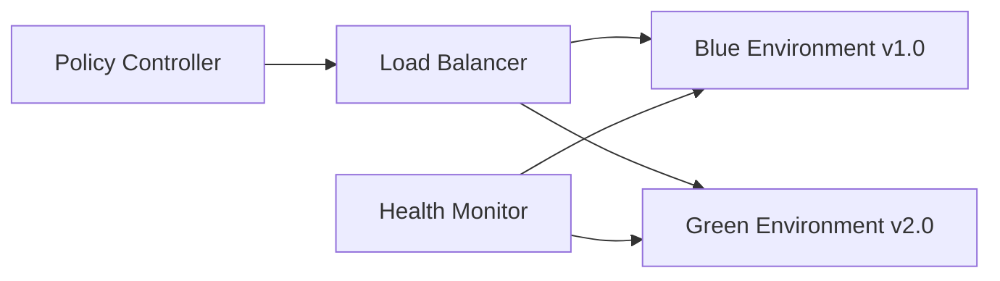

# Dynamic Scale System - Technical Specification v1.0

## Abstract

The Dynamic Scale System is a self-evolving, model-agnostic platform designed to provide real-time policy management with adaptive scaling capabilities. This specification defines the architecture, components, and implementation strategies for a system that maintains operational stability while supporting live policy updates and configuration changes.

## 1. Dynamic Scale Definition

### 1.1 Core Properties

The Dynamic Scale is a metric system characterized by:

- **Evolutionary Adaptation**: The scale undergoes directed evolution through machine learning algorithms that optimize performance based on historical data and real-time feedback
- **Model Agnosticism**: Compatible with any computational model or framework through standardized interface contracts
- **Non-linear Growth Patterns**: Employs logarithmic and exponential scaling functions with configurable growth curves
- **Entropy Tolerance**: Maintains system stability within defined chaos boundaries (entropy threshold: 0.15-0.85)
- **Real-time Self-adjustment**: Continuous recalibration based on system load, performance metrics, and environmental conditions

### 1.2 Mathematical Foundation

```
Dynamic Scale Formula:
DS(t) = α * log(β * t + γ) + δ * e^(ε * entropy(t)) + ζ * feedback(t-1)

Where:
- α, β, γ, δ, ε, ζ = evolutionary parameters
- t = time component
- entropy(t) = system entropy at time t
- feedback(t-1) = previous cycle feedback score
```

### 1.3 Adaptation Mechanisms

- **Genetic Algorithm Evolution**: Parameters evolve through selection, crossover, and mutation
- **Reinforcement Learning Integration**: Q-learning for policy optimization
- **Bayesian Inference**: Uncertainty quantification for decision making
- **Gradient Descent**: Fine-tuning of scale parameters

## 2. System Architecture

### 2.1 Hierarchical Component Structure

```
┌─────────────────────────────────────────┐
│            Orchestration Layer           │
├─────────────────────────────────────────┤
│         Policy Management Layer         │
├─────────────────────────────────────────┤
│          Verification Layer             │
├─────────────────────────────────────────┤
│           Service Layer                 │
├─────────────────────────────────────────┤
│         Data Access Layer               │
└─────────────────────────────────────────┘
```

### 2.2 Error Bubbling Architecture

Each component implements the `ErrorBubble` interface:

```typescript
interface ErrorBubble {
  componentId: string;
  errorLevel: ErrorLevel;
  errorCode: string;
  message: string;
  context: Map<string, any>;
  timestamp: ISO8601;
  stackTrace: string[];
  recovery: RecoveryStrategy;
}

enum ErrorLevel {
  INFO = 0,
  WARN = 1,
  ERROR = 2,
  CRITICAL = 3,
  FATAL = 4
}
```

### 2.3 Policy Shuffling Mechanism

#### 2.3.1 Policy Structure
```json
{
  "policyId": "uuid-v4",
  "version": "semver",
  "namespace": "service.operation.division.country.org",
  "rules": [],
  "dependencies": [],
  "conflicts": [],
  "rollbackPoint": "version",
  "activationStrategy": "blue-green|canary|immediate"
}
```

#### 2.3.2 Shuffling Algorithm
1. **Validation Phase**: Verify policy integrity and dependencies
2. **Conflict Resolution**: Check against active policies using dependency graph
3. **Staging Phase**: Load policy into isolated environment
4. **Gradual Activation**: Deploy using specified activation strategy
5. **Monitoring Phase**: Real-time health checks and rollback triggers

### 2.4 Semantic Versioning for Policies

- **Major Version (X.y.z)**: Breaking changes, incompatible API modifications
- **Minor Version (x.Y.z)**: New features, backward compatible
- **Patch Version (x.y.Z)**: Bug fixes, security patches

#### Version Compatibility Matrix
```
Current: 2.3.1
Compatible: 2.0.0 - 2.9.9
Upgrade Path: 2.3.1 → 2.4.0 → 3.0.0
Rollback Limit: 2 major versions
```

### 2.5 Verification Layer

#### 2.5.1 Conflict Detection Engine
- **Dependency Graph Analysis**: Detect circular dependencies
- **Resource Conflict Resolution**: Memory, CPU, network resource conflicts
- **Semantic Conflict Detection**: Business rule contradictions
- **Temporal Conflict Analysis**: Time-based policy conflicts

#### 2.5.2 Verification Algorithms
```python
def verify_policy_compatibility(new_policy, active_policies):
    conflicts = []
    
    # Resource conflict check
    if has_resource_overlap(new_policy, active_policies):
        conflicts.append(ResourceConflict())
    
    # Semantic verification
    semantic_conflicts = semantic_analyzer.check(new_policy, active_policies)
    conflicts.extend(semantic_conflicts)
    
    # Dependency validation
    if not dependency_resolver.can_resolve(new_policy.dependencies):
        conflicts.append(DependencyConflict())
    
    return VerificationResult(conflicts)
```

## 3. Integration Components

### 3.1 Open Access Credit Score System

#### 3.1.1 Score Calculation (0-3 Scale)
```
Production Credit Score = (Reliability * 0.4) + (Performance * 0.3) + (Security * 0.2) + (Compliance * 0.1)

Where each component is normalized to 0-3:
- 0.0-0.75: Critical Risk
- 0.76-1.5: Moderate Risk  
- 1.51-2.25: Low Risk
- 2.26-3.0: Excellent Standing
```

#### 3.1.2 Score Components
- **Reliability Score**: Uptime, error rates, recovery time
- **Performance Score**: Response time, throughput, resource efficiency
- **Security Score**: Vulnerability assessment, compliance adherence
- **Compliance Score**: Legal requirements, audit results

### 3.2 Legal Compliance Framework

#### 3.2.1 Hierarchical Structure
```
serviceoperation.division.country.org

Examples:
- payment.processing.americas.usa.fintech
- data.storage.europe.germany.healthcare
- analytics.reporting.apac.singapore.retail
```

#### 3.2.2 Compliance Matrix
| Level | Responsibility | Enforcement |
|-------|---------------|-------------|
| Service | Technical compliance | Automated checks |
| Operation | Process compliance | Policy validation |
| Division | Business compliance | Audit trails |
| Country | Legal compliance | Regulatory reporting |
| Organization | Corporate compliance | Executive oversight |

### 3.3 Gamification Metrics

#### 3.3.1 Service Usage Tracking
- **Engagement Score**: API calls, feature usage, session duration
- **Quality Score**: Error rates, user satisfaction, performance metrics
- **Innovation Score**: New feature adoption, feedback contribution
- **Collaboration Score**: Cross-team integrations, knowledge sharing

#### 3.3.2 Achievement System
```json
{
  "achievements": [
    {
      "id": "high_availability",
      "name": "99.9% Uptime Champion",
      "criteria": "uptime >= 99.9% for 30 days",
      "points": 1000,
      "badge": "gold_shield"
    }
  ]
}
```

### 3.4 Policy Bindings as Code Wrappers

#### 3.4.1 Binding Interface
```typescript
interface PolicyBinding {
  bind<T>(target: T, policyId: string): T;
  unbind<T>(target: T, policyId: string): T;
  validate(target: any, policy: Policy): ValidationResult;
  monitor(binding: Binding): Observable<BindingHealth>;
}
```

#### 3.4.2 Code Generation
```python
@policy_bound("rate_limiting_v2.1.0")
class APIEndpoint:
    def handle_request(self, request):
        # Auto-generated policy enforcement
        return self._process(request)
```

## 4. Real-time Policy Swapping Implementation

### 4.1 Blue-Green Deployment Strategy



### 4.2 Canary Release Protocol

1. **Traffic Splitting**: Route 5% traffic to new policy
2. **Metric Collection**: Monitor error rates, latency, throughput
3. **Automated Decision**: Promote or rollback based on thresholds
4. **Gradual Rollout**: 5% → 25% → 50% → 100%

### 4.3 Rollback Mechanisms

#### 4.3.1 Automatic Rollback Triggers
- Error rate > 5% increase
- Response time > 200ms increase
- Resource utilization > 80%
- Critical error count > 10/minute

#### 4.3.2 Rollback Execution
```python
class RollbackExecutor:
    def execute_rollback(self, trigger: RollbackTrigger):
        # 1. Stop new traffic routing
        self.traffic_manager.halt_new_routing()
        
        # 2. Drain connections
        self.connection_manager.drain_gracefully()
        
        # 3. Restore previous version
        self.policy_manager.restore_version(trigger.rollback_version)
        
        # 4. Verify system health
        health = self.health_checker.verify_system()
        
        return RollbackResult(success=health.is_healthy())
```

## 5. Error Handling Architecture

### 5.1 Unified Error Structure

```typescript
class UnifiedError {
  constructor(
    public componentId: string,
    public level: ErrorLevel,
    public code: string,
    public message: string,
    public context: ErrorContext,
    public cause?: UnifiedError
  ) {}
  
  bubble(): void {
    this.notify_parent();
    this.log_error();
    this.trigger_recovery();
  }
}
```

### 5.2 Error Bubbling Flow

```
Component Error → Local Handler → Bubble Up → Parent Component → Escalation → System Recovery
     ↓               ↓              ↓              ↓                ↓              ↓
  Log Locally → Try Recovery → Notify Parent → Assess Impact → Execute Strategy → Monitor Result
```

### 5.3 Recovery Strategies

#### 5.3.1 Strategy Selection Algorithm
```python
def select_recovery_strategy(error: UnifiedError) -> RecoveryStrategy:
    if error.level <= ErrorLevel.WARN:
        return RetryStrategy(max_attempts=3)
    elif error.level == ErrorLevel.ERROR:
        return CircuitBreakerStrategy(timeout=30)
    elif error.level == ErrorLevel.CRITICAL:
        return FallbackStrategy(backup_service=True)
    else:  # FATAL
        return ShutdownStrategy(graceful=True)
```

## 6. Performance Specifications

### 6.1 System Requirements
- **Policy Swap Time**: < 100ms for 95th percentile
- **Error Bubbling Latency**: < 10ms per layer
- **Credit Score Calculation**: < 50ms
- **Verification Layer**: < 200ms for complex policies

### 6.2 Scalability Targets
- **Concurrent Policies**: Up to 10,000 active policies
- **Request Throughput**: 100,000 requests/second
- **Policy Updates**: 1,000 updates/minute
- **Error Processing**: 50,000 errors/second

## 7. Security Considerations

### 7.1 Policy Security
- **Encryption**: AES-256 for policy storage
- **Authentication**: OAuth 2.0 with JWT tokens
- **Authorization**: Role-based access control (RBAC)
- **Audit Logging**: Complete policy change trail

### 7.2 Runtime Security
- **Sandboxing**: Isolated policy execution environments
- **Resource Limits**: CPU, memory, network quotas
- **Threat Detection**: Real-time security monitoring
- **Incident Response**: Automated threat mitigation

## 8. Monitoring and Observability

### 8.1 Key Metrics
- **System Health**: Error rates, response times, resource usage
- **Policy Performance**: Execution time, success rates, resource consumption
- **Business Metrics**: Credit scores, compliance status, gamification engagement

### 8.2 Alerting Framework
- **Threshold-based**: Static limits for critical metrics
- **Anomaly Detection**: ML-based pattern recognition
- **Predictive Alerts**: Forecast-based early warnings
- **Escalation Policies**: Automated notification chains

## 9. Testing Strategy

### 9.1 Testing Pyramid
- **Unit Tests**: Individual component validation
- **Integration Tests**: Cross-component interaction
- **System Tests**: End-to-end policy lifecycle
- **Chaos Engineering**: Failure injection and recovery validation

### 9.2 Policy Testing
```python
class PolicyTestSuite:
    def test_policy_validation(self):
        assert policy_validator.validate(test_policy).is_valid
    
    def test_conflict_detection(self):
        conflicts = conflict_detector.check(new_policy, existing_policies)
        assert len(conflicts) == 0
    
    def test_rollback_mechanism(self):
        rollback_result = policy_manager.rollback("v1.2.3")
        assert rollback_result.success == True
```

## 10. Implementation Roadmap

### Phase 1: Core Infrastructure (Months 1-3)
- Error bubbling architecture
- Basic policy management
- Verification layer foundation

### Phase 2: Dynamic Scaling (Months 4-6)
- Evolutionary algorithms
- Real-time adaptation
- Performance optimization

### Phase 3: Integration Components (Months 7-9)
- Credit score system
- Legal compliance framework
- Gamification metrics

### Phase 4: Advanced Features (Months 10-12)
- Real-time policy swapping
- Advanced monitoring
- Security hardening

## Conclusion

The Dynamic Scale System provides a robust, scalable solution for real-time policy management with built-in error handling, compliance tracking, and performance optimization. The architecture ensures system stability while enabling continuous adaptation to changing requirements and conditions.